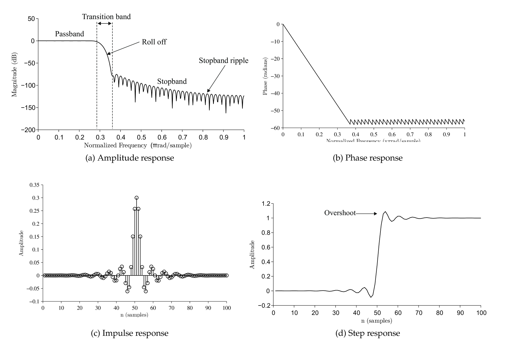

# Digital Signal Processing

## What is Digital Signal Processing?

This chapter provides a quick overview of digital signal processing DSP . DSP is inherent part of many measurement system and at least post processing of data before actual analysis and is therefore included in this course.

#### Signal processing
The purpose of signal processing is to improve the quality of a signal by suppressing noise. It can also be used to get rid off redundant information to store and transmit data more efficiently.

SciPy has extensive DSP functionality in scipy.signal namespace.
- DSP deals with digital signals on computers.
- Analog signal processing is implemented using components: resistors, capacitors, inductors.
- Digital filters are more accurate and cheaper than analog ones and don’t suffer from aging.

## Filter types
Filtering aims to remove unwanted noise from a signal or separate several sources from one measured signal.
- **Lowpass filter** is used to remove high frequencies.
- **Highpass filter** is used to remove low frequencies.
- **Bandpass filter** is used to remove low and high frequencies.
- **Bandreject filter** is used to remove a certain frequency band between low and high frequencies.
 
#### Ideal filters

Filters are not perfect so in practice filtered data also contains filtered frequencies, but they are greatly attenuated.

## Filter properties
#### Choosing the correct filter

Filters can be optimized for either time domain or frequency domain performance, but it is not possible to optimize a filter for both applications.

- **Time domain** performance of the filter is measured with step response and phase response.
- **Frequency domain** performance is measured with amplitude response.
- Step and Amplitude response can be calculated from impulse response.

The frequency response of a filter can be obtained from its impulse response by Fourier transforming it and the step response is the cumulative sum of the impulse response. 

#### Filtering causes distortion

Every filter causes some amount of distortion to filtered signal. It is important to be aware of the properties of the filter you use.

<b> Figure 1 : Filter terminology for step and amplitude response. 100th order Blackman FIR lowpass filter.
</b>

The properties of a filter are characterized by the following concepts and Figure 1

- **Amplitude response** is the ratio between input and output signals. The aim is to get a sharp attenuation and no ripple on - passband ( Figure 1 a). It is sometimes also called the frequency response.
- **Phase response** is the change in the phase of the input signal after filtering.
- **Linear phase** filters have the same phase shift for all frequencies.
- **Zero phase** filters have no phase shift.
- **Impulse response** is the filters output when the input is a unit signal.
- **Step response** is the filters output when the input is a step signal. Good step response is sharp and doesn’t overshoot.

## Filter properties using SciPy

SciPy filter design and analysis code is in `scipy.signal` namespace. There are several function to design and analyze filters.

However SciPy doesn’t have good functions for plotting amplitude response or phase response. So here are two useful functions that can be used to plot filter properties. You’ll need to import `scipy.signal` in order to use them.
